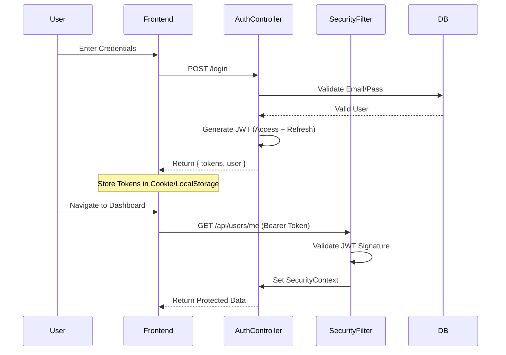

# Authentication API

Base URL: `/api/auth`

## 🔐 Auth Flow



## Endpoints

### Register User
Create a new user account.

-   **URL**: `/register`
-   **Method**: `POST`
-   **Auth**: Public

**Request Body**
```json
{
  "email": "user@example.com",
  "password": "strongpassword123",
  "firstName": "John",
  "lastName": "Doe"
}
```

**Response (201 Created)**
```json
{
  "accessToken": "eyJhbG...",
  "refreshToken": "eyJhbG...",
  "user": { ... }
}
```

### Login
Authenticate headers and receive tokens.

-   **URL**: `/login`
-   **Method**: `POST`
-   **Auth**: Public

**Request Body**
```json
{
  "email": "user@example.com",
  "password": "password"
}
```

### Get Current User
Retrieve the profile of the currently logged-in user.

-   **URL**: `/me`
-   **Method**: `GET`
-   **Auth**: Bearer Token
