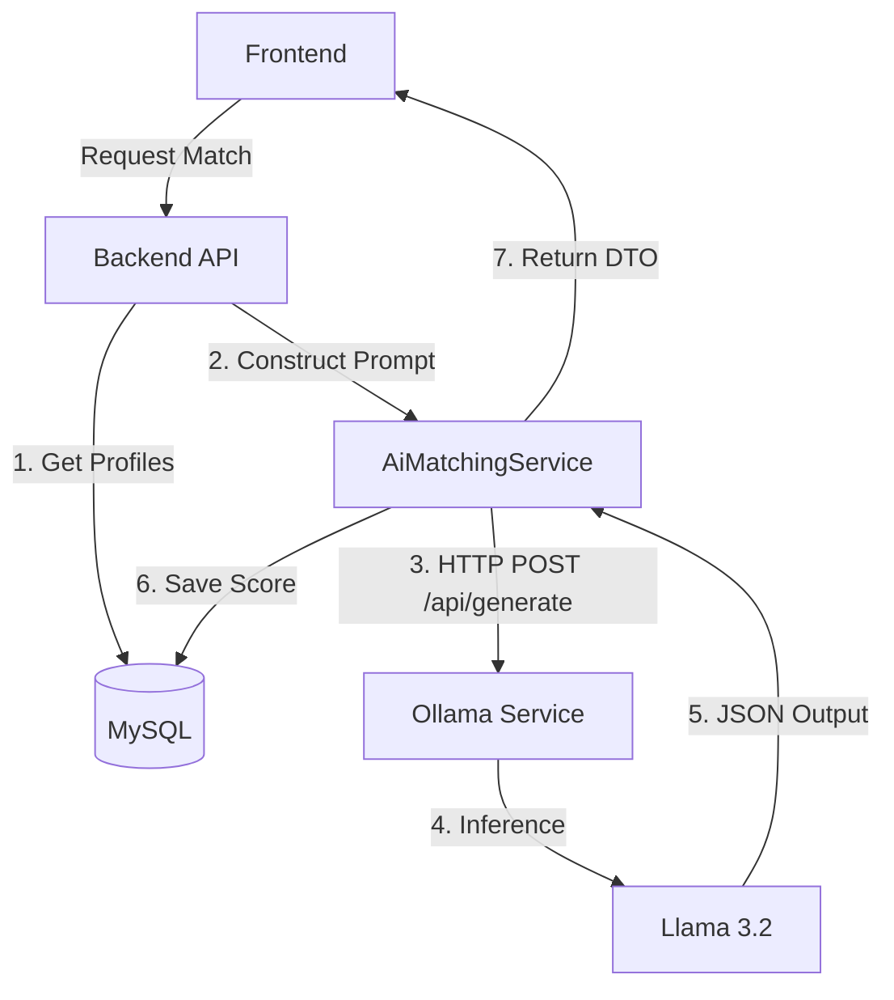

# AI Architecture (Ollama Integration)

The StayMate AI implementation focuses on **privacy-first**, **local inference** for analyzing roommate compatibility.

## 🧠 System Architecture

## 🤖 The Model: Llama 3.2
We selected **Llama 3.2** for its balance of reasoning capability and lower resource footprint, making it ideal for local deployment.

### Why not OpenAI / Cloud LLMs?
1.  **Privacy**: User lifestyle data (personally identifiable information) never leaves our infrastructure.
2.  **Cost**: Zero per-token cost; only fixed infrastructure cost.
3.  **Latency**: Local network calls are faster than round-trip API calls to US servers.

## 🛠 Prompt Engineering
We use **Few-Shot Prompting** to ensure strict JSON output.

### System Prompt
> "You are an expert behavioral psychologist. Analyze the following two roommate profiles for compatibility. Output your analysis STRICTLY in the following JSON format..."

### Validation Layer
To prevent "hallucinations" or broken JSON:
1.  **Strict Mode**: We force JSON mode in Ollama where supported.
2.  **Schema Validation**: The backend validates the response against a `MatchResult` DTO.
3.  **Retry Logic**: If JSON parsing fails, we retry with a simpler prompt or fallback to rule-based scoring.

## 🔮 Future Scalability
As user base grows, the AI layer can be scaled independently:
-   **Horizontal Scaling**: Deploy multiple Ollama containers behind a load balancer.
-   **Quantization**: Use 4-bit quantized models to reduce RAM usage by 50%.
