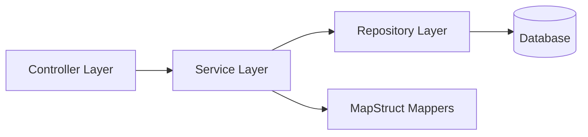

# Backend Architecture

StayMate's backend is a monolithic Spring Boot application designed with clean architecture principles, ready for microservices decomposition.

## 🏗 Layered Design

We follow a strict separation of concerns:

### 1. Controller Layer (`web`)
-   **Responsibility**: Handle HTTP requests, validate input (`@Valid`), and return `ResponseEntity`.
-   **Security**: Annotated with `@PreAuthorize` for role-based access.
-   **Example**: `RoommateController.java`

### 2. Service Layer (`service`)
-   **Responsibility**: Business logic, transactional boundaries (`@Transactional`).
-   **Key Services**:
    -   `RoommateService`: Hybrid matching logic.
    -   `AiService`: Integration with Ollama.
    -   `DashboardService`: Complex data aggregation.

### 3. Repository Layer (`repository`)
-   **Responsibility**: Data access via Spring Data JPA.
-   **Features**: Custom JPQL queries for complex filtering (e.g., `searchPosts`).

### 4. Domain Model (`domain`)
-   **Entities**: JPA entities mapping to MySQL tables.
-   **DTOs**: Data Transfer Objects to decouple API contracts from database schema.

## 🛠 Key Technologies

-   **Spring Boot 3.2**: Core framework.
-   **Spring Security**: JWT-based stateless auth.
-   **Flyway**: Database migration version control.
-   **MinIO**: S3-compatible object storage.
-   **Lombok**: Reduces boilerplate code.
-   **MapStruct**: Type-safe bean mapping.
