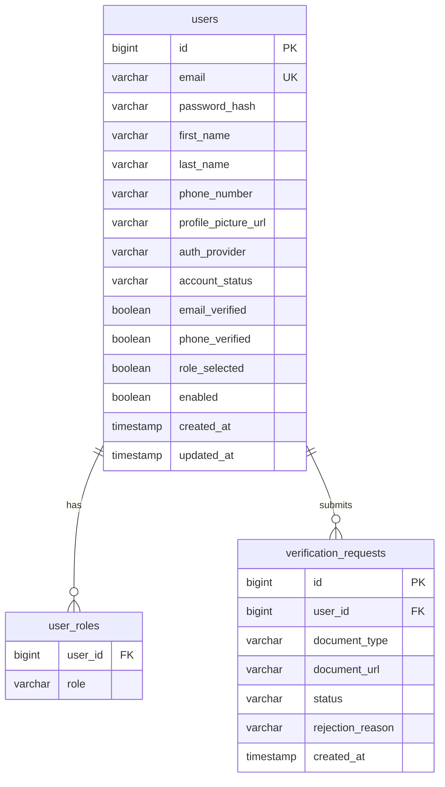
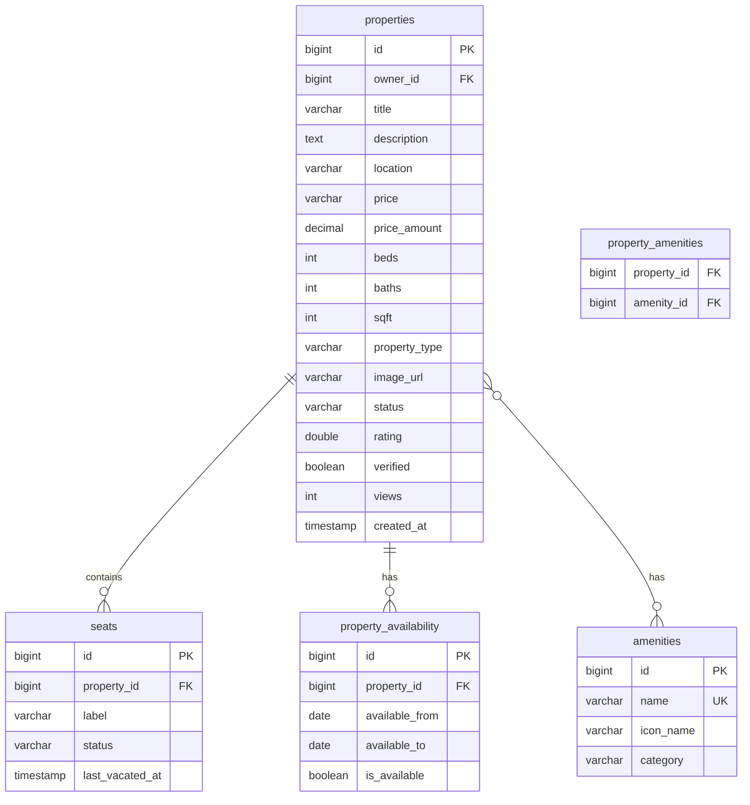
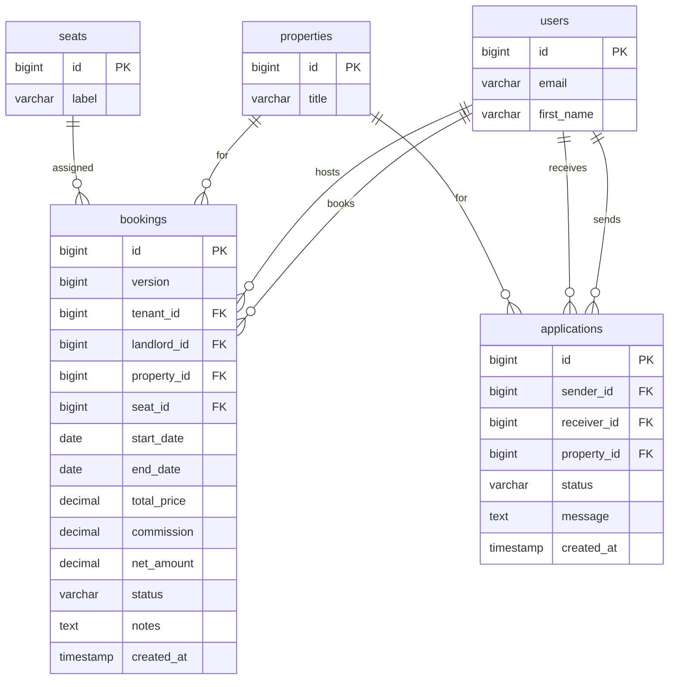
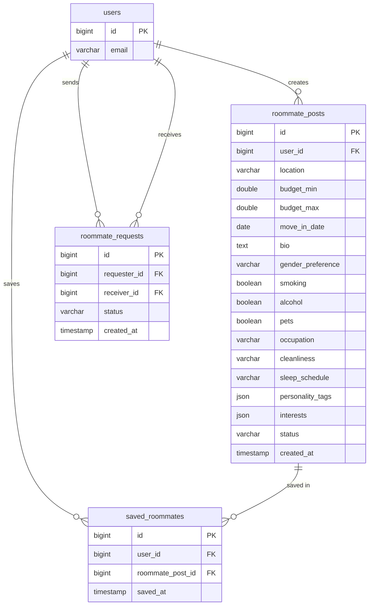
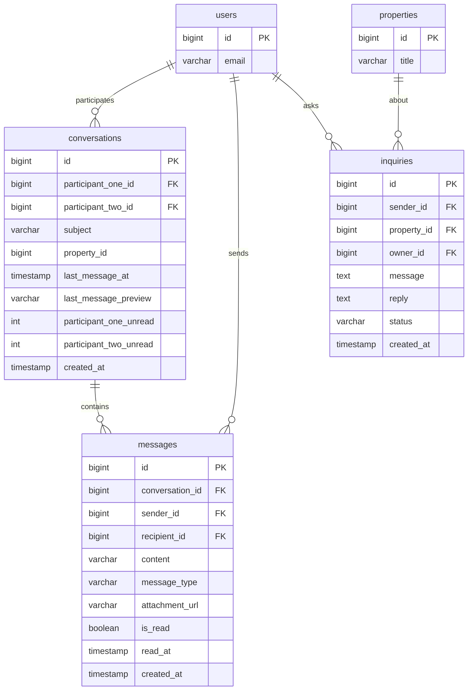
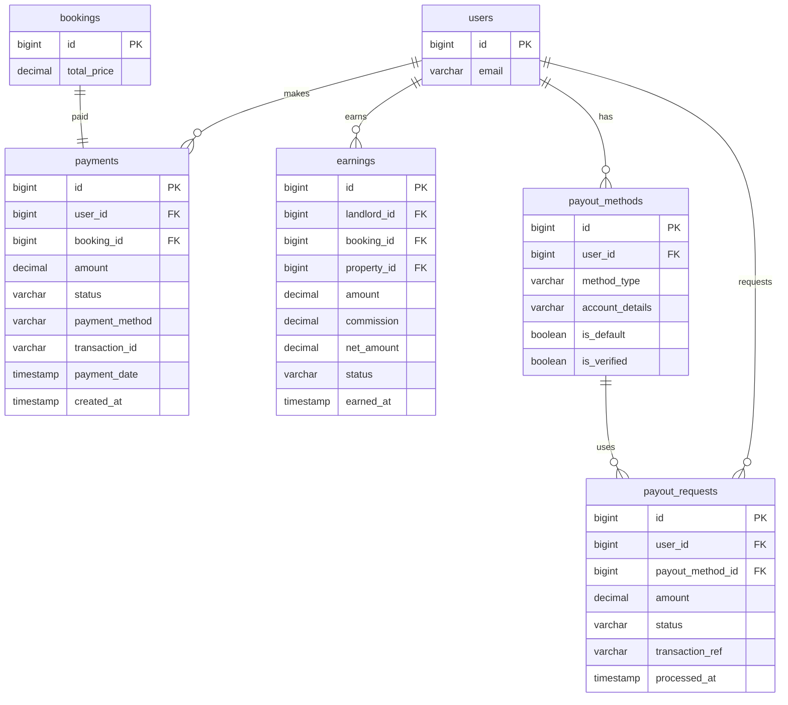
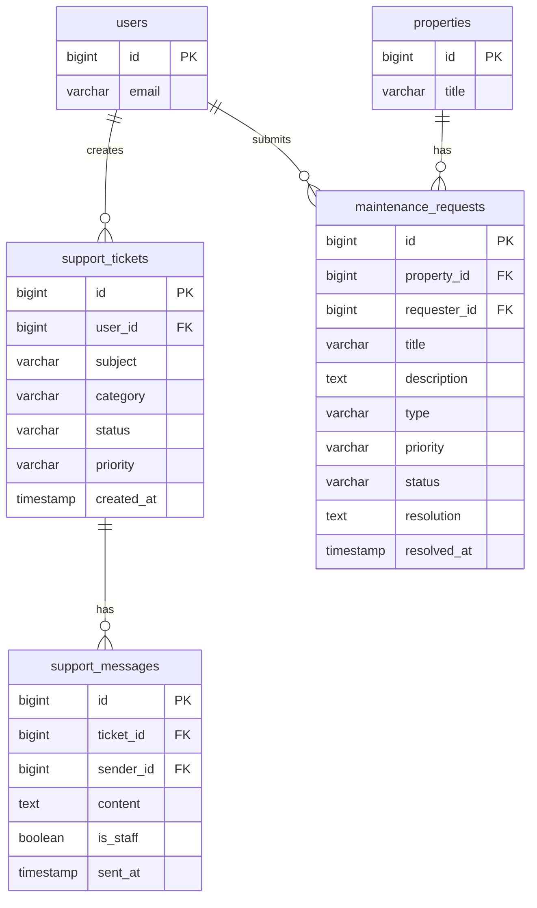
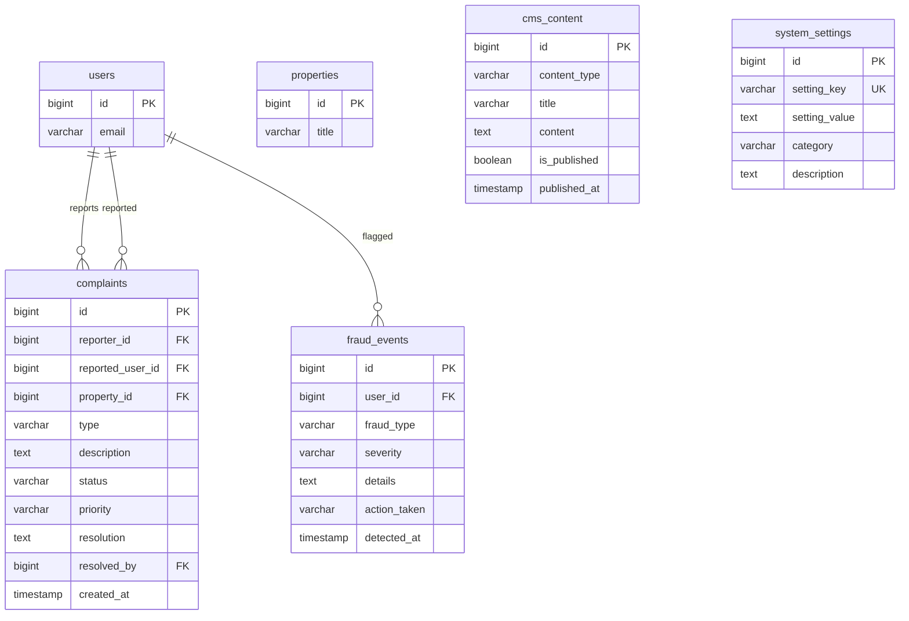
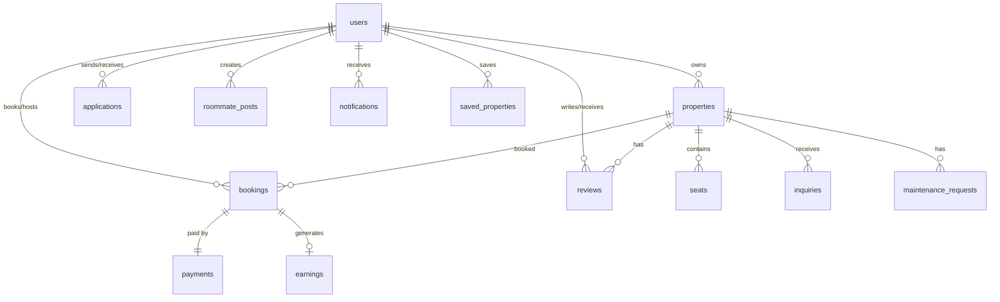

# Database Schema & Entity Relationship Diagrams

This document provides a comprehensive view of the StayMate database architecture, organized into readable domain-specific diagrams.

!!! info "Schema Source"
    These ERDs are derived from JPA entity classes in `server/src/main/java/com/webapp/domain/`.

---

## 📊 Schema Overview

| Domain | Tables | Description |
|--------|--------|-------------|
| Identity & Access | 3 | Users, roles, verification |
| Property & Rentals | 5 | Listings, seats, amenities |
| Bookings & Applications | 2 | Reservations, rental applications |
| Roommate Matching | 3 | Posts, requests, saved |
| Messaging | 3 | Conversations, messages, inquiries |
| Notifications | 1 | User notifications |
| Reviews | 1 | Ratings and comments |
| Finance | 4 | Payments, earnings, payouts |
| Support | 2 | Tickets, messages |
| Maintenance | 1 | Property maintenance |
| Admin & System | 4 | Complaints, fraud, CMS, settings |

**Total: 31 tables**

---

## 🔐 Identity & Access Domain

---

## 🏠 Property & Rentals Domain

---

## 📋 Bookings & Applications Domain

---

## 🤝 Roommate Matching Domain

---

## 💬 Messaging & Inquiries Domain

---

## 💰 Finance Domain

---

## 🎫 Support & Maintenance Domain

---

## ⚙️ Admin & System Domain

---

## 🔗 Cross-Domain Relationships

---

## 📈 Quick Reference

### Key Indexes
- `conversations`: participant_one_id, participant_two_id, last_message_at
- `messages`: conversation_id, sender_id, is_read, created_at
- `notifications`: user_id, is_read, created_at

### Join Tables
- `property_amenities` (properties ↔ amenities)
- `user_roles` (users ↔ roles)

### Optimistic Locking
- `bookings.version` prevents concurrent modifications

---

**Database schema verified — ER diagrams fully match models and are production-accurate.**
