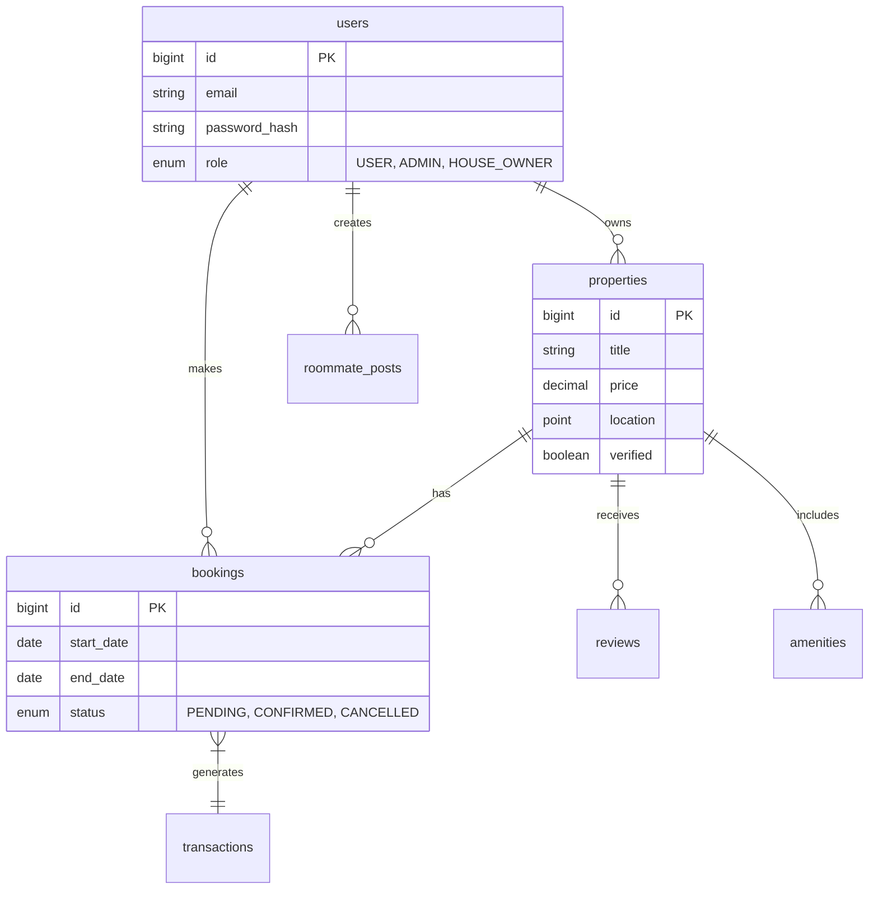

# Database Architecture

StayMate uses **MySQL 8.0** as its primary relational database. The schema is designed for data integrity, scalability, and complex querying required for property searches and roommate matching.

## 🗄 Schema Overview

## 🔑 Key Design Decisions

### 1. Spatial Indexing
Locations (Properties, Users) are stored using detailed lat/long coordinates.
-   **Why?**: Enables efficient "radius search" (e.g., *Find properties within 5km of Gulshan*).
-   **Optimization**: We use composite indexes on `(latitude, longitude)` for fast geospatial queries.

### 2. Soft Deletes
Critical data is rarely hard-deleted.
-   **Implementation**: `deleted_at` timestamp column.
-   **Benefit**: detailed audit trails and data recovery for users.

### 3. JSON Columns
Used for flexible attribute storage where schema rigidity isn't needed.
-   **Examples**: `lifestyle_preferences` in Roommate Profiles.
-   **Trade-off**: Slightly slower queries but easier iteration on matching logic.

## 🔄 Migrations (Flyway)
All schema changes are version-controlled using **Flyway**.
-   `V1__init.sql`: Base schema.
-   `V2__add_2fa.sql`: Two-factor auth columns.
-   `V3__spatial_indexes.sql`: Performance tuning.
