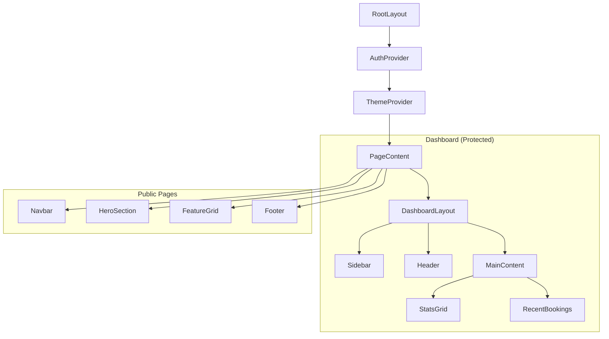

# Frontend Architecture

The StayMate frontend is a modern **Next.js 14** application using the **App Router** for improved performance and SEO.

## 📐 Project Structure

```text
src/
├── app/                 # App Router pages and layouts
│   ├── dashboard/       # Protected dashboard routes
│   ├── roommates/       # Roommate matching feature
│   └── page.tsx         # Landing page
├── components/          # Reusable UI components
│   ├── ui/              # Base UI elements (shadcn/ui)
│   └── roommates/       # Feature-specific components
├── lib/                 # Utilities and API clients
│   └── api.ts           # Centralized Axios instance
├── types/               # TypeScript definitions
└── hooks/               # Custom React hooks
```

## 🏗 Component Hierarchy



## 🧩 Key Decisions

### Server vs. Client Components
-   **Server Components**: Used for initial data fetching (SEO optimized).
-   **Client Components**: Used for interactive elements (Forms, Maps, Dashboards).

### Styling Strategy
-   **Tailwind CSS**: For utility-first styling.
-   **shadcn/ui**: For accessible, pre-built components (Radix UI wrapper).

### State Management
-   **Server State**: Handled via Next.js caching and revalidation.
-   **Client State**: React Context for global state (Auth, Theme).

## 📡 API Integration
All API calls are centralized in `lib/api.ts` using **Axios**.
-   **Interceptors**: Automatically attach JWT tokens to requests.
-   **Error Handling**: Global error catching for uniform UX.
