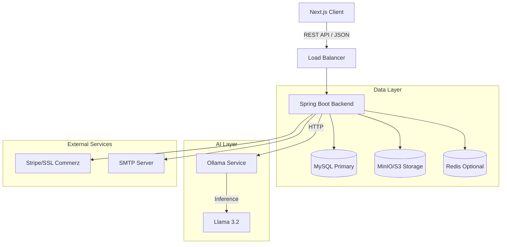

# System Overview

StayMate is built on a robust, scalable microservices-inspired architecture (monolithic deployment for MVP, ready for split).

## 🏗 High-Level Architecture

## 🔄 Core Data Flow

1.  **User Interaction**: Users interact with the sleek **Next.js** frontend.
2.  **API Gateway**: Requests are routed to the **Spring Boot** backend.
3.  **Authentication**: JWT-based stateless authentication secures all endpoints.
4.  **Business Logic**: Services (PropertyService, RoommateService) process logic.
5.  **Data Persistence**: **MySQL** stores relational data; **MinIO** stores images.
6.  **AI Enrichment**: The `AiService` sends prompts to **Ollama** for matching analysis.

## 🧩 Component Breakdown

### Frontend (User Level)
- **Framework**: Next.js 14 (App Router)
- **Styling**: Tailwind CSS + shadcn/ui
- **State**: React Hooks + Context API

### Backend (Service Level)
- **Framework**: Spring Boot 3.2
- **Security**: Spring Security + JWT
- **ORM**: Hibernate / JPA
- **Migrations**: Flyway

### Infrastructure (DevOps Level)
- **Containerization**: Docker & Docker Compose
- **CI/CD**: GitHub Actions (Linting, Testing)
- **Monitoring**: Spring Actuator + JMeter Reports
