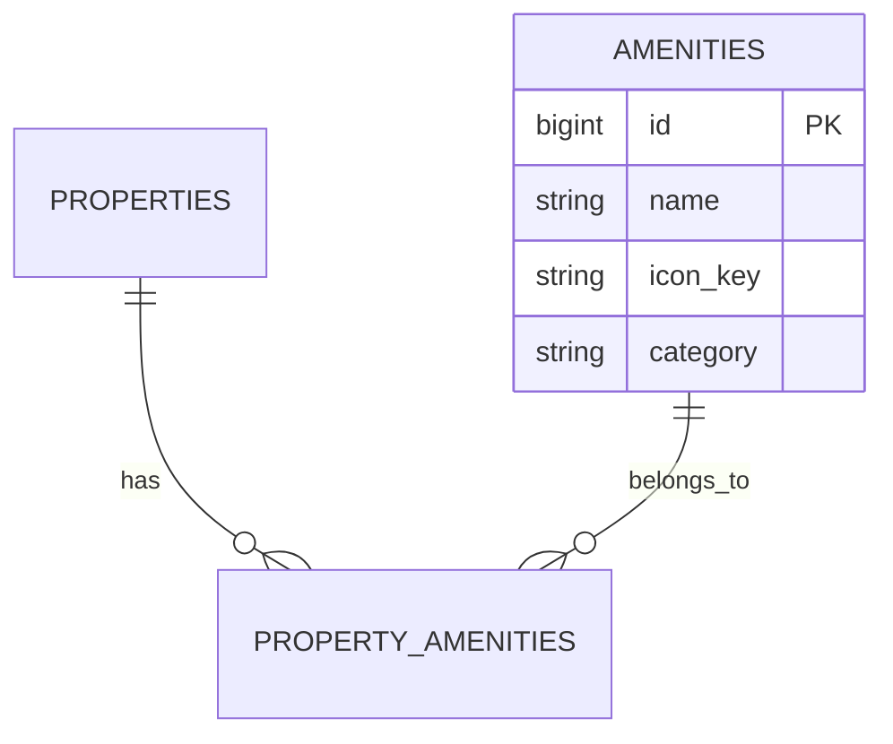

# Amenities Framework

Amenities are structured attributes that define what a property offers. StayMate uses a scalable, categorized system for amenities to power search filters and matching logic.

## 🌟 Amenity Categories

Amenities are grouped to help users quickly assess a property:

| Category | Examples | Icon Strategy |
|----------|----------|---------------|
| **Essentials** | Wifi, Heating, Air Conditioning | `lucide-react` |
| **Kitchen** | Dishwasher, Microwave, Coffee Maker | `lucide-react` |
| **Laundry** | Washer, Dryer, Iron | `lucide-react` |
| **Outdoor** | Balcony, Garden, BBQ | `lucide-react` |
| **Safety** | Smoke Alarm, Fire Extinguisher, CCTV | `lucide-react` |

## 🛠 Data Structure

Amenities are stored in a many-to-many relationship with properties.



## 🔍 Search & Filtering
The amenities system powers the "Advanced Filters" on the search page.
-   **Exact Match**: Users can select specific amenities (e.g., "Must have AC").
-   **Count Sort**: Properties with *more* amenities rank higher in "Best Value" sort.

## 🎨 UI Implementation
On the frontend, we map `icon_key` strings from the database (e.g., `"wifi"`) to actual Lucide React components dynamically:

```typescript
// Frontend Icon Mapping Strategy
const iconMap = {
  wifi: <Wifi />,
  parking: <Car />,
  gym: <Dumbbell />,
};
```
