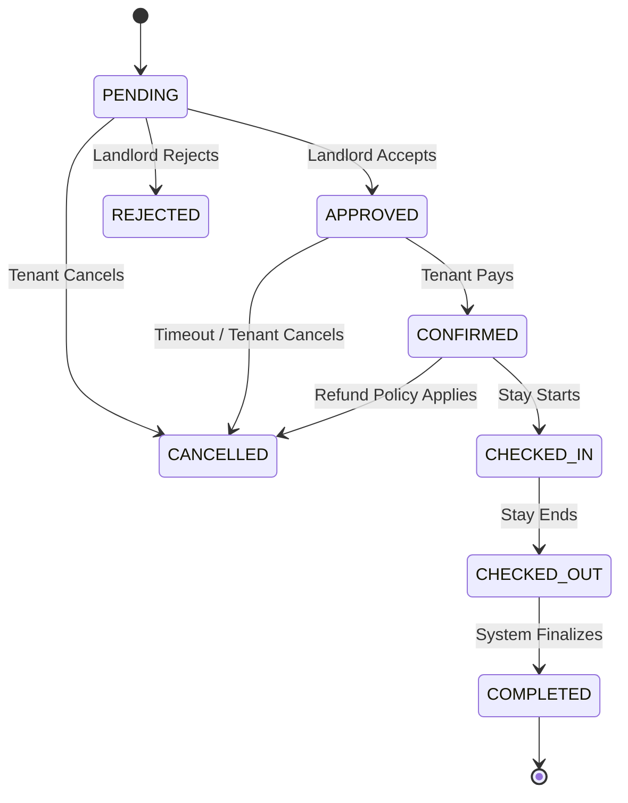

# Booking System

The Booking System manages the lifecycle of property rentals, from initial request to final payout.

## 🔄 Booking Lifecycle

The system moves bookings through strict state transitions to ensure financial security.

## 🏷 Status Definitions

| Status | Description | Role Action |
|--------|-------------|-------------|
| `PENDING` | Request sent. Dates are blocked tentatively. | Tenant creates. |
| `APPROVED` | Landlord agreed. Awaiting payment. | Landlord approves. |
| `CONFIRMED` | Paid. Booking is active. Calendar blocked. | System confirms payment. |
| `CHECKED_IN` | Tenant has arrived. Payout eligible. | Tenant/Landlord triggers. |
| `CHECKED_OUT` | Stay finished. Unit available closely. | Tenant/Landlord triggers. |
| `COMPLETED` | Review period over. Funds released. | System auto-trigger. |
| `CANCELLED` | Booking voided. Refund processed if applicable. | Any role. |
| `REJECTED` | Landlord declined request. | Landlord triggers. |

## 💰 Payments & Refund Policy
-   **Service Fee**: Platform takes a % fee on `CONFIRMED` bookings.
-   **Security Deposit**: Held in escrow until `CHECKED_OUT`.
-   **Refunds**:
    -   *Before Check-in*: 100% refund (minus fee).
    -   *During Stay*: Pro-rated based on days stayed.

## 🛡 Validations
-   **Double Booking Prevention**: Overlapping dates for the same property are automatically rejected.
-   **Self-Booking**: Users cannot book their own properties.
-   **Verification**: Only fully verified users can request bookings.
