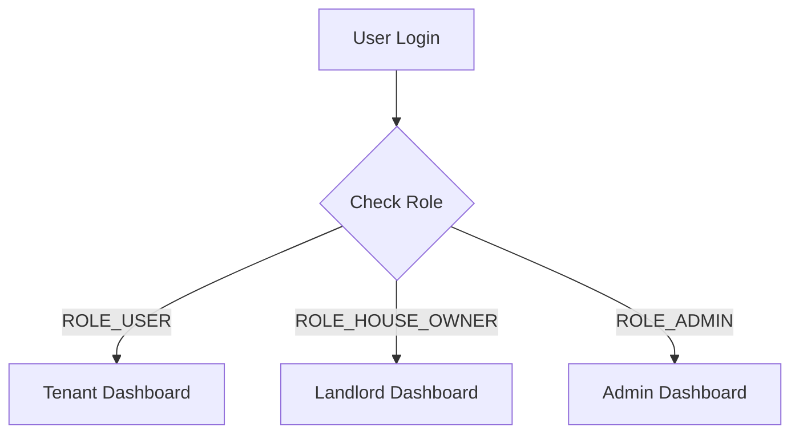

# Dashboards

StayMate offers role-specific dashboards to provide relevant insights and actions for every user type.

## 📊 Dashboard Overview

## 👤 Tenant Dashboard
Focused on finding a home and managing current stays.
-   **Active Applications**: Track status of sent booking requests.
-   **Upcoming Bookings**: View move-in dates and landlord details.
-   **Matched Roommates**: See top AI-recommended roommate matches.
-   **Saved Items**: Quick access to bookmarked properties.
-   **Notifications**: Real-time alerts for booking updates and roommate requests.

## 🏠 Landlord Dashboard
Focused on occupancy and revenue.
-   **Portfolio Overview**: Total properties, active listings, and vacancies.
-   **Financial Charts**: Monthly revenue trends and payout history.
-   **Incoming Requests**: Approve/Reject tenant applications.
-   **Property Health**: View reported maintenance issues.

## 🛡 Admin Dashboard
Focused on platform health, moderation, and financial oversight.

### 1. User Management
-   **Verification Queue**: Review ID documents for manual verification.
-   **Ban/Suspend**: Disable accounts for policy violations.
-   **User Deletion**: Initiate or cancel scheduled deletions (3-day grace period).

### 2. Financial Oversight
-   **Platform Revenue**: View total commissions (Service Fees).
-   **Payout Approvals**: Review and process landlord withdrawal requests.
-   **Refunds**: Manually trigger refunds for cancelled bookings.

### 3. System Metrics
-   **Growth Stats**: New users, total bookings, active listings.
-   **Health**: Monitor API latency and AI service availability.
