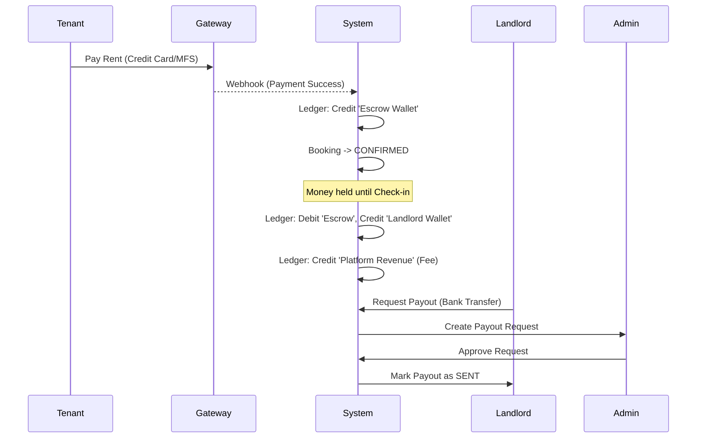

# Finance & Earnings

StayMate includes a ledger-based finance system to handle rent collection, payouts, and platform revenue.

## 💸 Financial Flow

## 📊 Landlord Earnings
Landlords can track:
-   **Total Revenue**: Gross earnings before fees.
-   **Pending Payouts**: Funds eligible for withdrawal.
-   **Withdrawn**: Funds already sent to bank.

### Payout Methods
Supported withdrawal channels:
-   **Bank Transfer**: Directly to local bank account.
-   **Mobile Wallet**: bKash, Nagad (BDT).

## 👮 Admin Oversight
Admins have a dedicated **Finance Dashboard** to:
-   View total platform ecosystem value (GMV).
-   Track net platform revenue (Commissions).
-   Approve/Reject landlord payout requests.
-   Process refunds for cancelled bookings.

## 🛠 API Reference
See [Earnings API](../api/earnings.md) for endpoint details.
