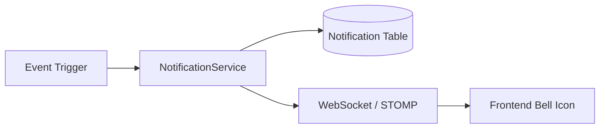

# Notifications System

StayMate uses a robust notification engine to keep users engaged and informed about critical updates.

## 🔔 Notification Architecture

## 📨 Notification Types

The `NotificationType` enum defines the following alert categories:

| Type | Trigger | Action |
|------|---------|--------|
| `BOOKING_REQUEST` | Tenant sends a booking request. | Redirects Landlord to Booking Manager. |
| `BOOKING_STATUS` | Landlord Approve/Reject. | Redirects Tenant to My Bookings. |
| `ROOMMATE_REQUEST` | User requests to team up. | Redirects to Roommate Requests. |
| `ACCOUNT_UPDATE` | Profile changes or Security alerts. | Redirects to Profile/Settings. |
| `PAYOUT_STATUS` | Admin approves payout. | Redirects Landlord to Earnings. |
| `SYSTEM_ALERT` | Maintenance or downtime warnings. | General alert. |

## 🛠 Features

-   **Real-time Delivery**: Instant UI updates via WebSockets (if connected).
-   **Persistent History**: All notifications are stored in MySQL for later viewing.
-   **Read/Unread State**: Users can mark single or all notifications as read.
-   **Filtering**: Backend supports filtering by "Unread Only" or specific types.
