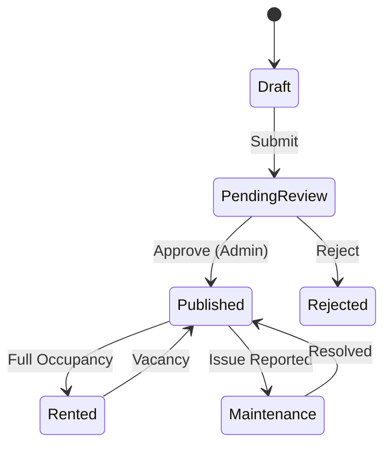

# Property Management

StayMate provides comprehensive tools for landlords to manage their rental portfolio.

## 🏠 Property Lifecycle

## features

### 1. Listing Creation
-   **Rich Details**: Upload high-res images, set amenities, and describe house rules.
-   **Location**: Pinpoint location on interactive maps.
-   **Pricing**: Set monthly rent, deposit, and service fees.

### 2. Dashboard Analytics
-   **Views & Impressions**: Track how many tenants are viewing your property.
-   **Occupancy Rate**: Real-time view of filled vs. empty rooms.
-   **Financials**: Track total earnings and pending payouts.

### 3. Verification Badge
All properties undergo a verification process.
-   **Manual Review**: Admins check proof of ownership.
-   **Trust Signal**: Verified properties get a "Blue Tick" and rank higher in search.

## 📱 For Tenants
-   **Advanced Search**: Filter by price, location, amenities, and move-in date.
-   **Interactive Map**: View properties in relation to work/university.
-   **Saved Listings**: Bookmark favorites for later comparison.
