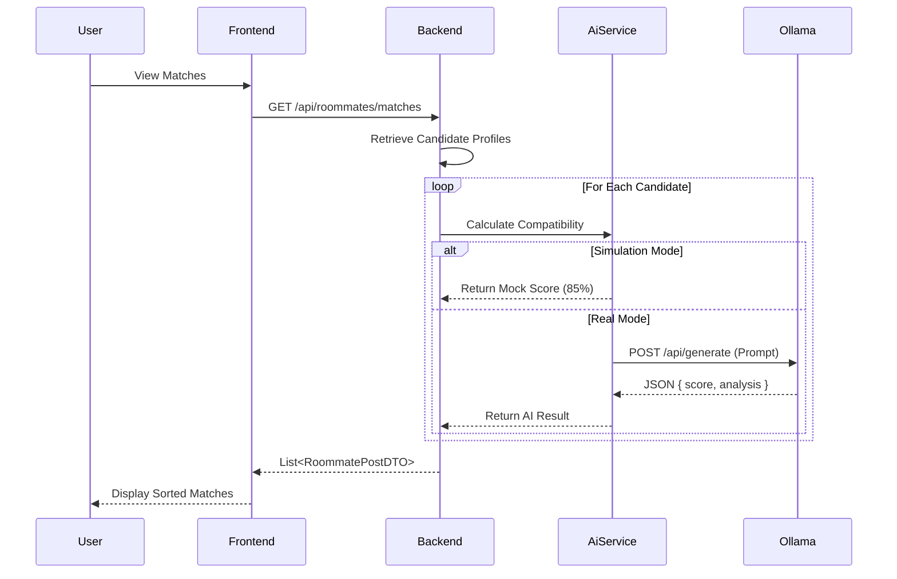

# AI-Powered Roommate Matching

Finding a compatible roommate is more than just budget and location. StayMate uses **Ollama (Llama 3)** to analyze personality traits and lifestyle habits.

## How It Works

### 1. The Match Profile
Every tenant completes a lifestyle survey covering:
- **Sleep Schedule**: Early bird vs. Night owl.
- **Cleanliness**: Specialized standards.
- **Social Habits**: Party animal vs. Introvert.
- **Guests & Pets**: Policies on visitors and animals.

### 2. The AI Analysis
When a user views a potential roommate or a room listing, our **AiService**:
1. Checks for `X-Simulation-Mode` header (for load testing).
2. Retrieves both profiles from `UserService`.
3. Anonymizes the data (removes PII).
4. Sends a prompt to the local **Ollama** instance.
5. Receives a JSON compatibility score (0-100) and analysis.

### 3. The Match Score Implementation
The `RoommateService.java` implementation uses a hybrid scoring system:
1.  **Hard Filters**: Location & Budget (Must match).
2.  **Rule-Based Score**: Java-based calculation for basics (Smoking, Pets).
3.  **AI Enrichment**: Ollama provides the "Vibe Check" summary and nuanced compatibility insights.

### 4. Privacy First
We believe in privacy. The AI **never** sees:
- Real Names
- Contact Information
- ID Documents

It only processes *behavioral tags*, ensuring unbiased and safe matching.
