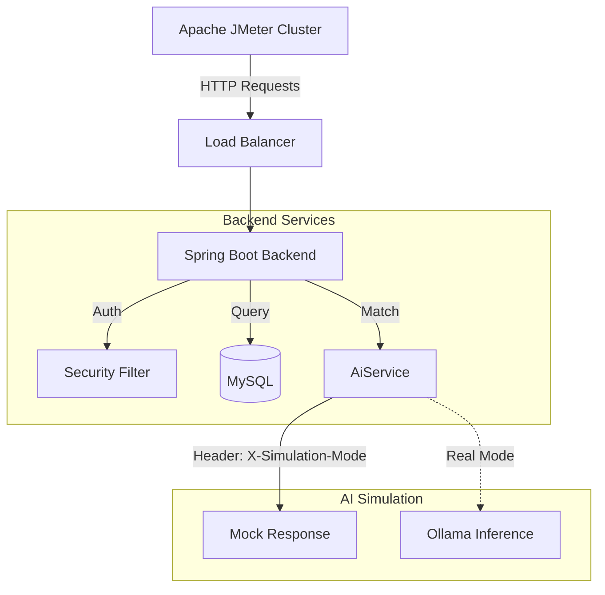

# Load Testing Strategy

Ensure StayMate is production-ready using our **Power-Pact Load Testing Suite**.

## 🏗 Load Test Architecture



## 🛠 Tools & Infrastructure

-   **Tool**: Apache JMeter 5.6.3
-   **Script Location**: `load-testing/jmeter/staymate-load-test.jmx`
-   **Runner Script**: `load-testing/Start-LoadTest.sh`

## 🧪 Scenarios

### 1. Tenant Flow (High Volume)
-   **User**: Logs in (JWT extraction).
-   **Search**: Browse properties with filters.
-   **Match**: Request AI Roommate Matches.
-   **Safety**: Uses `X-Simulation-Mode: true` to bypass expensive LLM inference during stress tests.

### 2. Landlord Flow (Critical Path)
-   **User**: Logs in.
-   **Dashboard**: Views earnings and occupancy (computationally expensive).
-   **Create**: Posts a new property (Database write).

### 3. User Deletion Stress Test
-   **Delete Account**: Simulates users deleting their own account to verify cascade deletion performance and stability (low volume).

## 🚀 Running Tests

### Quick Start (Safe Mode)
Run the convenience script from the project root:
```bash
./load-testing/Start-LoadTest.sh
```
*This runs in `SIMULATION_MODE=true` to mock AI calls.*

### Real AI Smoke Test
To test the actual Ollama integration (low concurrency only):
```bash
cd load-testing/jmeter
./run-load-test.sh --tenant-users 1 --landlord-users 1 --duration 60
```

## 📊 Performance Thresholds

The CI/CD pipeline enforces these SLAs:

| Metric | Threshold | Consequence |
|--------|-----------|-------------|
| **Error Rate** | `< 1%` | Test Failure |
| **API Latency (P95)** | `< 500ms` | Warning |
| **Dashboard Load** | `< 800ms` | Warning |
| **AI Match (Real)** | `< 3000ms` | Warning |

## 🛡 AI Load Safety
To prevent bringing down the inference server, the backend `AiService` checks for a special header:
`X-Simulation-Mode: true`.
When present, it returns a static mock response immediately.
