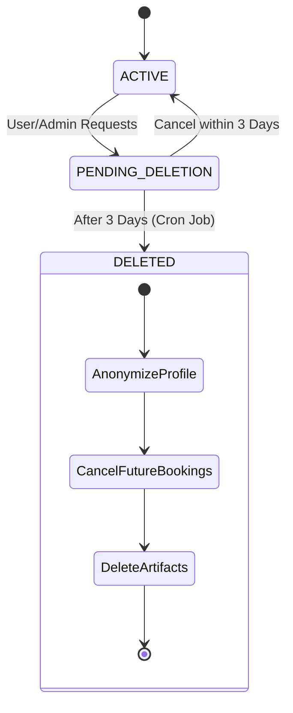

# Data Protection & Privacy

StayMate is designed with **Privacy by Design** principles, ensuring user data is secure, anonymized where necessary, and deletable upon request (GDPR Compliance).

## 🛡 User Deletion Lifecycle

We implement a **Soft Delete with Grace Period** mechanism to prevent accidental data loss and ensure auditability.

### 1. Initiation (Grace Period)
-   **Action**: User requests deletion via Settings or Admin triggers it.
-   **Status**: Account marked `PENDING_DELETION`.
-   **Effect**: Login disabled. Scheduled deletion date set (T+3 days).
-   **Notification**: Email sent with cancellation instructions.

### 2. Execution (The "Cascade")
After the grace period, the `UserDeletionService` executes a permanent cleanup:

| Domain | Action | Detail |
|--------|--------|--------|
| **Profile** | **Anonymize** | Name -> "Deleted User", Email -> `deleted_ID@...`, PII removed. |
| **Bookings** | **Cancel Future** | Future bookings cancelled & refunded. Past bookings kept for financial audit. |
| **Roommates** | **Delete** | All roommate posts and requests removed. |
| **Notifications** | **Delete** | All user notifications wiped. |
| **Properties** | **Deactivate** | (Landlords only) All listings marked `INACTIVE`. |

## 🔒 Data Security Measures

### PII Protection
-   **Passwords**: Bcrypt hashed.
-   **AI Processing**: User data is anonymized *before* being sent to Ollama.
-   **Role-Based Access**: `@PreAuthorize` annotations ensure Tenants cannot access Landlord financial data.

### Audit Logs
-   Critical actions (Deletion, Payouts, verification) are logged to `audit_logs` table (immutable).
