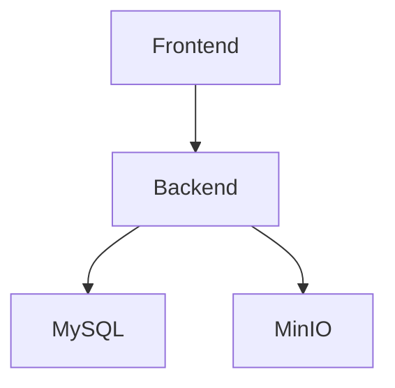

# 🐳 Docker Deployment Guide

This guide covers running StayMate using Docker and Docker Compose.

---

## Prerequisites

- Docker 24+
- Docker Compose 2.0+

```bash
docker --version
docker compose version
```

---

## Quick Start

```bash
# Clone repository
git clone https://github.com/staymate/staymate.git
cd StayMate

# Create environment file
cp .env.example .env

# Start all services
docker compose up -d

# View logs
docker compose logs -f
```

---

## Docker Compose Services

### Development Stack (`docker-compose.yml`)

| Service | Image | Port | Description |
|---------|-------|------|-------------|
| `mysql-db` | mysql:8.0 | 3306 | Database |
| `minio` | minio/minio:latest | 9005, 9006 | Object storage |
| `server` | Custom build | 8080 | Spring Boot API |
| `frontend` | Custom build | 3000 | Next.js app |

### Service Dependencies



---

## Configuration

### Environment Variables

All services read from the root `.env` file:

```bash
# Database
DB_PASSWORD=your_password
DB_NAME=staymate

# MinIO
MINIO_ROOT_USER=minioadmin
MINIO_ROOT_PASSWORD=minioadmin
```

### Volumes

| Volume | Purpose |
|--------|---------|
| `mysql_data` | Persistent database storage |
| `minio_data` | Persistent file storage |

---

## Common Commands

### Start Services

```bash
# All services
docker compose up -d

# Specific service
docker compose up -d mysql-db minio
```

### Stop Services

```bash
# Stop all
docker compose down

# Stop and remove volumes (⚠️ deletes data)
docker compose down -v
```

### View Logs

```bash
# All services
docker compose logs -f

# Specific service
docker compose logs -f server
```

### Rebuild Images

```bash
docker compose build --no-cache
docker compose up -d
```

---

## Service Health Checks

### Check Running Containers

```bash
docker compose ps
```

### Individual Health

```bash
# MySQL
docker exec staymate-mysql mysqladmin ping -h localhost

# Backend
curl http://localhost:8080/api/health

# MinIO
curl http://localhost:9005/minio/health/live
```

---

## Production Deployment

For production, use `docker-compose.prod.yml`:

```bash
docker compose -f docker-compose.prod.yml up -d
```

### Key Differences

| Aspect | Development | Production |
|--------|-------------|------------|
| Debug logging | Enabled | Disabled |
| Hot reload | Enabled | Disabled |
| SSL | None | Enabled |
| Rate limiting | Disabled | Enabled |

---

## Troubleshooting

### Container Won't Start

```bash
# Check logs
docker compose logs server

# Check container status
docker inspect staymate-backend-local
```

### Database Connection Failed

```bash
# Verify MySQL is healthy
docker compose ps mysql-db

# Check MySQL logs
docker compose logs mysql-db
```

### Port Already in Use

```bash
# Find process using port
lsof -i :8080

# Kill process
kill -9 <PID>
```

### Clean Restart

```bash
docker compose down -v
docker system prune -f
docker compose up -d --build
```

---

## See Also

- [Local Setup Guide](local-setup.md)
- [Environment Variables](environment.md)
