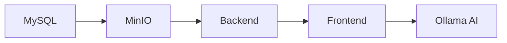

# 🚀 Local Development Setup Guide

This guide walks you through setting up StayMate locally for development and testing.

---

## Prerequisites

Before starting, ensure you have the following installed:

| Tool | Version | Purpose |
|------|---------|---------|
| **Node.js** | 18+ | Frontend runtime |
| **Java JDK** | 17 | Backend runtime |
| **Maven** | 3.8+ | Backend build tool |
| **Docker** | 24+ | Containerized services |
| **Docker Compose** | 2.0+ | Multi-container orchestration |
| **Git** | Latest | Version control |

!!! tip "Verify Installations"
    ```bash
    node --version    # Should show v18+
    java --version    # Should show 17+
    mvn --version     # Should show 3.8+
    docker --version  # Should show 24+
    ```

---

## Quick Start (Docker Compose)

The fastest way to run StayMate locally is using Docker Compose, which starts all services automatically.

### 1. Clone the Repository

```bash
git clone https://github.com/staymate/staymate.git
cd StayMate
```

### 2. Create Environment File

```bash
cp .env.example .env
```

Edit `.env` with your configuration (or use defaults for local development).

### 3. Start All Services

```bash
docker compose up -d
```

This starts:

| Service | Port | Description |
|---------|------|-------------|
| **MySQL** | 3306 | Database |
| **MinIO** | 9005 (API), 9006 (Console) | Object storage |
| **Backend** | 8080 | Spring Boot API |
| **Frontend** | 3000 | Next.js app |

### 4. Verify Services

```bash
docker compose ps
```

All services should show `running` status.

### 5. Access the Application

- **Frontend**: [http://localhost:3000](http://localhost:3000)
- **Backend API**: [http://localhost:8080](http://localhost:8080)
- **MinIO Console**: [http://localhost:9006](http://localhost:9006)

---

## Manual Setup (Step-by-Step)

For more control, you can run each service individually.

### Step 1: Database Setup (MySQL)

#### Option A: Docker (Recommended)

```bash
docker run -d \
  --name staymate-mysql \
  -e MYSQL_ROOT_PASSWORD=password \
  -e MYSQL_DATABASE=staymate \
  -p 3306:3306 \
  mysql:8.0
```

#### Option B: Local MySQL

1. Install MySQL 8.0
2. Create database:

```sql
CREATE DATABASE staymate;
CREATE USER 'staymate_user'@'localhost' IDENTIFIED BY 'your_password';
GRANT ALL PRIVILEGES ON staymate.* TO 'staymate_user'@'localhost';
FLUSH PRIVILEGES;
```

!!! note "Schema Management"
    Schema is auto-managed by Flyway migrations. No manual schema setup required.

---

### Step 2: MinIO Setup (File Storage)

MinIO provides S3-compatible object storage for file uploads.

```bash
docker run -d \
  --name staymate-minio \
  -e MINIO_ROOT_USER=minioadmin \
  -e MINIO_ROOT_PASSWORD=minioadmin \
  -p 9005:9000 \
  -p 9006:9001 \
  minio/minio:latest server /data --console-address ":9001"
```

#### Create the Upload Bucket

1. Open MinIO Console: [http://localhost:9006](http://localhost:9006)
2. Login: `minioadmin` / `minioadmin`
3. Create bucket: `staymate-uploads`
4. Set bucket access policy to **Public** (for local dev)

---

### Step 3: Backend Setup (Spring Boot)

#### 3.1 Navigate to Server Directory

```bash
cd server
```

#### 3.2 Configure Environment

The backend reads configuration from `application.properties`. Default values work for local Docker setup.

Key environment variables (set in `.env` or export directly):

| Variable | Default | Description |
|----------|---------|-------------|
| `DB_HOST` | localhost | MySQL host |
| `DB_PORT` | 3306 | MySQL port |
| `DB_NAME` | staymate | Database name |
| `DB_PASSWORD` | password | MySQL root password |
| `MINIO_URL` | http://localhost:9005 | MinIO API URL |
| `JWT_SECRET` | (auto-generated) | JWT signing key |

#### 3.3 Build and Run

```bash
# Build
mvn clean package -DskipTests

# Run
mvn spring-boot:run
```

Or with explicit profile:

```bash
mvn spring-boot:run -Dspring-boot.run.profiles=dev
```

#### 3.4 Verify Backend

```bash
curl http://localhost:8080/api/health
# Should return: {"status":"UP"}
```

---

### Step 4: Frontend Setup (Next.js)

#### 4.1 Navigate to Frontend Directory

```bash
cd frontend
```

#### 4.2 Install Dependencies

```bash
npm install
```

#### 4.3 Configure Environment

Create `.env.local`:

```bash
NEXT_PUBLIC_API_URL=http://localhost:8080
BACKEND_URL=http://localhost:8080
```

#### 4.4 Run Development Server

```bash
npm run dev
```

#### 4.5 Verify Frontend

Open [http://localhost:3000](http://localhost:3000) in your browser.

---

## AI Roommate Matching (Ollama)

StayMate uses Ollama for AI-powered roommate matching.

### Install Ollama

```bash
# macOS
brew install ollama

# Linux
curl -fsSL https://ollama.com/install.sh | sh

# Windows
# Download from https://ollama.com/download
```

### Start Ollama Service

```bash
ollama serve
```

### Pull the Model

```bash
ollama pull llama3.2
```

### Configure Backend

Ensure these values in `application.properties`:

```properties
ai.ollama.url=http://localhost:11434
ai.ollama.model=llama3.2
```

!!! tip "AI Fallback"
    If Ollama is unavailable, the system falls back to heuristic matching automatically.

---

## Environment Variables Reference

### Root `.env` File

```bash
# Database
DB_HOST=localhost
DB_PORT=3306
DB_NAME=staymate
DB_PASSWORD=password

# MinIO
MINIO_ROOT_USER=minioadmin
MINIO_ROOT_PASSWORD=minioadmin
MINIO_URL=http://localhost:9005
MINIO_PUBLIC_URL=http://localhost:9005
MINIO_BUCKET_NAME=staymate-uploads

# JWT (Generate with: openssl rand -base64 64)
JWT_SECRET=your_base64_encoded_secret

# OAuth2 (Optional)
GOOGLE_CLIENT_ID=your_google_client_id
GOOGLE_CLIENT_SECRET=your_google_client_secret

# Frontend
NEXT_PUBLIC_API_URL=http://localhost:8080
```

---

## Default Test Accounts

After startup, these accounts are available:

| Role | Email | Password |
|------|-------|----------|
| **Admin** | admin@gmail.com | admin123 |
| **User** | Register via UI | — |
| **House Owner** | Register via UI | — |

!!! warning "Production"
    Change default credentials before deploying to production!

---

## Running the Full Stack

### Recommended Startup Order



1. **Database** (MySQL)
2. **Object Storage** (MinIO)
3. **Backend** (Spring Boot)
4. **Frontend** (Next.js)
5. **AI Service** (Ollama) — Optional

### One-Command Startup

```bash
docker compose up -d && cd frontend && npm run dev
```

---

## Common Issues & Troubleshooting

### Port Conflicts

| Service | Port | Fix |
|---------|------|-----|
| MySQL | 3306 | `lsof -i :3306` then `kill <PID>` |
| Backend | 8080 | Change `server.port` in `application.properties` |
| Frontend | 3000 | Run `npm run dev -- -p 3001` |
| MinIO | 9005/9006 | Update docker-compose ports |

### Database Connection Failed

```bash
# Check MySQL is running
docker ps | grep mysql

# Check logs
docker logs staymate-mysql

# Verify connection
mysql -h localhost -u root -p -P 3306
```

### MinIO Upload Errors

1. Verify bucket exists: `staymate-uploads`
2. Check bucket policy is set to Public
3. Verify MinIO URL in backend config

### CORS Errors

Ensure `cors.allowed-origins` in `application.properties` includes:

```properties
cors.allowed-origins=http://localhost:3000,http://localhost:8080
```

### Build Failures

```bash
# Frontend
rm -rf node_modules package-lock.json
npm install

# Backend
mvn clean install -U
```

---

## JMeter Load Testing (Optional)

For performance testing, see the [JMeter Guide](../performance/jmeter.md).

Quick start:

```bash
cd load-testing
jmeter -n -t staymate-load-test.jmx -l results.jtl
```

---

## Verification Checklist

- [ ] MySQL is running on port 3306
- [ ] MinIO console accessible at http://localhost:9006
- [ ] `staymate-uploads` bucket exists
- [ ] Backend health check passes: `curl http://localhost:8080/api/health`
- [ ] Frontend loads at http://localhost:3000
- [ ] Can register a new user
- [ ] Can login with admin@gmail.com / admin123
- [ ] File uploads work (profile picture, property images)

---

## Next Steps

- [Docker Deployment](docker.md)
- [Environment Variables Reference](environment.md)
- [API Documentation](../api/authentication.md)

---

!!! success "Ready for Development"
    **Validated — Local setup documentation complete. StayMate can be fully run locally for testing and development.**
